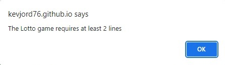
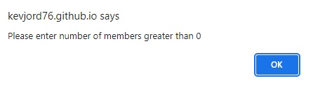

<!--- Web application name -->
# Lottery Syndicate (Random Numbers Generator)

<!--- Web application overview -->
Lottery Syndicate (Random Numbers Generator) is a game to allow the player to generate random lottery numbers. Many companies, organisations, families and friends have their own lottery syndicates set-up. This game allows those syndicates to create their own set of random numbers. There are three games available: Euromillions, Lotto and Dailymillions. The user selects the game they want to play and whether they want plus included. They then enter the number of lines required and the number of members in the syndicate. Once the generate button is activated, the random numbers are displayed on screen along with the costs involved.

<!--- Responsive design image -->

    

<!--- Outline the features of the web application -->
# Features

The web application contains a favicon of a selection of lottery balls. This is displayed in the document tab.

<!--- Favicon image -->
- __Favicon__

  

The header displays the name of the web application and again the logo of lottery balls. Under this the three lottery game options are outlined on three buttons. Green for Euromillions, red for Lotto and blue for Dailymillions. This is where the user chooses the lottery game that they want to play. The user can tab to the game buttons and hit the enter key or click on the game buttons to activate them. 

<!--- Header image -->
- __Header__

  

When one of the game buttons gets the focus or is hovered over the colour changes. For example the Lotto game button turns dark red.  

<!--- Hover image -->
- __Lotto Game Button__

  

When one of the game buttons is activated/chosen the generate numbers button text changes to the chosen game, e.g. Generate Lotto Numbers.  

<!--- Generate image -->
- __Generate Game Random Numbers__

  

The include plus draws check-box allows the user to choose if they want to include the extra plus draws in their lottery game selection. The final costs, then reflects their choice. The user can also hit the enter key to toggle their choice between checked and unchecked.   

<!--- Plus image -->
- __Lottery Plus Option__

  

The number of lines input box allows the user to enter the number of lottery lines that they want to create random numbers for. If the user enters 6, for example, then 6 random lines will be produced for the game type chosen. 

<!--- Number of lines image -->
- __Number of Lines__

  

The number of members input box allows the user to enter the number of lottery syndicate members. The calculated costs produced will then display the approximate cost per member of taking part in the syndicate.

<!--- Number of members image -->
- __Number of Members__

  

Once the user is happy with their choices entered/chosen they can then activate the generate random numbers button. The random numbers for the chosen game will then be displayed on screen along with the associated costs. Again the results displayed are colour coded for each game, dark green for Euromillions, dark red for Lotto and dark blue for Dailymillions. 

<!--- Results image -->
- __Results__

    

  

The page footer displays the rules of the game. 

<!--- Footer image -->
- __Footer__

  

<!--- Future features -->
- __Future Features__

  - The inclusion of the chosen game's results for the last draw that took place to be displayed on screen 
  - The inclusion of the chosen game's jackpot for the next draw to be displayed on screen
  - Unlimited number of lines can be entered

<!--- Outline the web application validation routines -->
# Data Entry Validation

The user must select a game before the generate numbers button is chosen. If no game has been chosen the following error message will display on screen. 

<!--- Select error -->
- __Game Selection Error__

  

The user must enter a number of lottery lines greater than zero (at least 2 for the Lotto game) and no greater than six. The following error messages will display on screen if this is not the case when the generate numbers button is activated. Focus will return to the number of lines input box after the error message is displayed.  

<!--- Number of lines errors -->
- __Number of Lines Errors__

  

  

The user must enter a number of members greater than zero. The following error message will display on screen if this is not the case when the generate numbers button is activated. Focus will return to the number of members input box after the error message is displayed.  

<!--- Number of members error -->
- __Number of Members Error__

  

<!--- Outline my testing -->
# Testing

- I tested that my web application works in different browsers: Microsoft Edge, Google Chrome and Mozilla Firefox, see below. I had to make some adjustments to my screen layout after this testing was completed, as, for example, my header logo did not appear correctly in Firefox.

<!--- Google Chrome, Microsoft Edge and Mozilla Firefox screenshots -->
Microsoft Edge

    

Google Chrome

    

Mozilla Firefox

  

- I tested and confirmed that my web application is responsive on different screen sizes using Chrome DevTools. I designed my web application on a Laptop, therefore my lineups are best suited to that screen size. I would have liked to have done some more testing on smaller and larger screen sizes. I spent a lot of time on my JavaScript validation routines so I had less time then to test my media queries and screen's responsiveness. I did test the web application on my mobile phone, and it worked well, see below.

Samsung Galaxy A22 5G
<!--- Phone image -->

  

- I tested and confirmed that my web application's text is readable and has a good contrast between the background and foreground colours. I have used three main colours for the foreground and background: white, grey and black. I also colour coded the games: green for Euromillions, red for Lotto and blue for Dailymillions. I did this to make the content stand out. I used one main font: Nunito Sans, the reason for this is that this font is a good font to display both text and numbers. I discovered this font on Google fonts.    

- I confirmed that my validation routines work, I activated the generate numbers button without choosing a game first. The expected alert message to choose a game appeared on screen. I tested the entry of too few, too many and blank game number of lines. The expected alert messages to enter a valid number of lines appeared on screen. I tested the entry of zero, a minus figure and blank syndicate members. The expected alert message to enter a valid number of members appeared on screen. It is not allowed to enter a float number into the number of lines and member input boxes. They are converted to an integer if a float number is entered. I confirmed that this worked.   

<!--- Outline the validator testing done -->
__Validator Testing__

- HTML
  - No errors were returned when passing index.html through the official [(W3C) validator](https://validator.w3.org/nu/?doc=https%3A%2F%2Fkevjord76.github.io%2Fmilestone-project-2%2F)
- CSS
  - No errors were returned when passing style.css through the official [(Jigsaw) validator](https://jigsaw.w3.org/css-validator/validator?uri=https%3A%2F%2Fkevjord76.github.io%2Fmilestone-project-2%2F&profile=css3svg&usermedium=all&warning=1&vextwarning=&lang=en) 
- JavaScript
  - One warning was returned when passing script.js through the JSHint JavaScript Validator

<!--- JSHint image -->

  

- Accessibility
  - I confirmed that the colours and font chosen are easy to read and accessible by running it through lighthouse in Chrome DevTools. I do have room for improvement here.

<!--- Lighthouse image -->

  

<!--- Outline the bugs found -->
__Fixed Bugs__

- After I deployed my web application in Github the logo image did not display correctly using the Firefox browser. I removed the float CSS style and this fixed the bug.

- I was getting an error when I ran my index.html file through the official W3C validator. I was calling a focusout function within the html file, I moved this function call to my script file and this fixed the error.

- A big issue/problem that I encountered was to make sure that my section/div heights and widths worked correctly on the different screen sizes. I had to make adjustments to these settings to get my responsive design to work correctly.

- I didn't want the user to be able to enter float numbers into the number of lines and members input boxes. I tried to use the onblur event, but this wasn't working correctly for me. In the end, I used the focusout event which worked for me. If a float number is entered, it is converted to an integer. 

- When I passed my script file through the JSHint JavaScript Validator I was informed that I was missing semi-colons at the end of some of my lines of code. I amended these errors.

<!--- Outline the deployment procedure -->
## Deployment

- The site was deployed to GitHub pages. The steps to deploy are as follows: 
  - In the GitHub repository, navigate to the Settings tab 
  - From the source section drop-down menu, select the Master/Main Branch
  - Once the master/main branch has been selected, the page will be automatically refreshed with a detailed ribbon display to indicate the successful deployment, see below. 

<!--- Deployment image -->

    

The live link can be found here - https://kevjord76.github.io/milestone-project-2/

- In GitHub you can also [Clone](https://docs.github.com/en/repositories/creating-and-managing-repositories/cloning-a-repository) or [Fork](https://docs.github.com/en/get-started/quickstart/fork-a-repo) this repository

To Clone:
1. On GitHub.com, navigate to the main page of the repository.
2. Above the list of files, click Code.
3. Copy the URL for the repository.
4. Open Git Bash.
5. Change the current working directory to the location where you want the cloned directory.
6. Type git clone, and then paste the URL you copied earlier.
7. Press Enter to create your local clone.

To Fork:
1. On GitHub.com, navigate to the octocat/Spoon-Knife repository.
2. In the top-right corner of the page, click Fork.
3. Select an owner for the forked repository.
4. By default, forks are named the same as their parent repositories.
5. Optionally, add a description of your fork.
6. Choose whether to copy only the default branch or all branches to the new fork.
7. Click Create fork.

<!--- List the credits -->
## Credits 

I would like to say thanks to Chris Quinn, who was my mentor for this project. He provided me with a lot of good advice and pointed me in the right direction when I was going the wrong way.

### Content 

- The numeric sort function that I used to order my lottery games random numbers in the correct order was discovered on [w3Schools](www.w3schools.com)
- The idea to create buttons for the lottery games and their styling was based on Code Institute's Love Maths walkthrough project and modified to suit the needs of this web application [Love Maths](https://code-institute-org.github.io/love-maths/index.html)
- The favicon that I used was converted from an image to an icon using [Convertio](https://convertio.co/)
- The font I used for this web application is Nunito Sans. I discovered this font on [Google fonts](https://fonts.google.com)  

### Media

- The images used for the logo and lottery section of my web application were taken from [Clipartmax](https://www.clipartmax.com) 