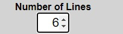
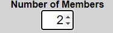

<!--- Application name -->
# Lottery Syndicate (Random Numbers Generator)

<!--- Application overview -->
Lottery Syndicate (Random Numbers Generator) is a game to allow the player to generate random lottery numbers. Many companies, organisations, families and friends have their own lottery syndicates set-up. This game allows those syndicates to create their own set of random numbers. There are three games available: Euromillions, Lotto and Dailymillions. The user selects the game they want to play and whether they want plus included. They then enter the number of lines required and the number of members in the syndicate. Once the generate button is activated, the random numbers are displayed on screen along with the costs involved.

<!--- Responsive design image -->

    

<!--- Outline the features of the application -->
# Features

The application contains a favicon of a selection of lottery balls. This is displayed in the document tab.

<!--- Favicon image -->
- __Favicon__

  

The header displays the name of the application and again the logo of lottery balls. Under this the three lottery game options are outlined on three buttons. Green for Euromillions, Red for Lotto and Blue for Dailymillions. This is where the user chooses the lottery game that they want to play. The user can tab to the game buttons and hit the enter key or click on the game buttons to activate them. 

<!--- Header image -->
- __Header__

  

When one of the game buttons gets the focus or is hovered over the colour changes. For example the Lotto game button turns dark red.  

<!--- Active image -->
- __Lotto Game Button__

  

When one of the game buttons is activated/chosen the generate numbers button text changes to the chosen game, e.g. Generate Lotto Numbers.  

<!--- Generate image -->
- __Generate Random Numbers__

  

The include plus draws check-box allows the user to choose if they want to include the extra plus draws in their lottery game selection. The final costs, then reflects their choice. The user can also hit the enter key to toggle their choice between checked and unchecked.   

<!--- Plus image -->
- __Lottery Plus Option__

  

The number of lines input box allows the user to enter the number of lottery lines that they want to create random numbers for. If the user enters 6, for example, then 6 random lines will be produced for the game type chosen. 

<!--- Number of lines image -->
- __Number of Lines__

  

The number of members input box allows the user to enter the number of lottery syndicate members. The calculated costs produced will then display the approximate cost per member of taking part in the syndicate.

<!--- Number of members image -->
- __Number of Members__

  

Once the user is happy with their choices entered/chosen they can then activate the generate random numbers button. The random numbers for the chosen game will then be displayed on screen along with the associated costs. 

<!--- Results image -->
- __Results__

    

  

The page footer displays the rules of the game. 

<!--- Footer image -->
- __Footer__

  

<!--- Future Features -->
- __Future Features__

  -   The inclusion of the chosen game's results for the last draw that took place to be displayed on screen 
  - The inclusion of the chosen game's jackpot for the next draw to be displayed on screen
  - Unlimited number of lines can be entered

